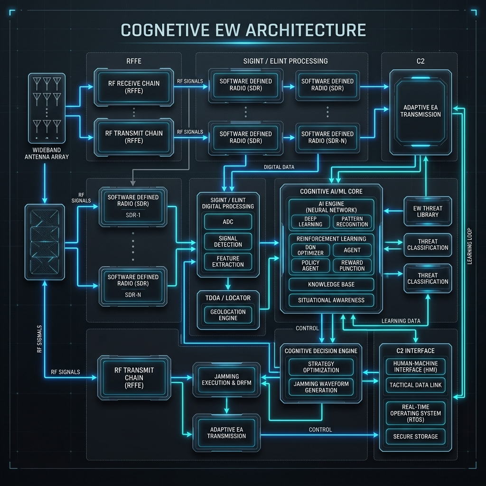

# ELEKTRONİK HARP YARIŞMASI 2026 - KTR/KDT HAZIRLIK DOKÜMANI

*(Not: Bu doküman, belirttiğiniz İçindekiler şablonuna tam uyumlu olarak ARAT takımının KIZAGAN OMEGA sistemi için derinlemesine teknik detaylarla doldurulmuştur.)*

---

# İÇİNDEKİLER
1. TEMEL SİSTEM ÖZETİ
1.1 Sistem Tanımı
1.2 Sistem Nihai Performans Özellikleri
2. ORGANİZASYON ÖZETİ
2.1 Takım Organizasyonu
2.2 Zaman Akış Çizelgesi ve Bütçe
3. DETAYLI TASARIM ÖZETİ
3.1 Nihai Sistem Mimarisi ve Alt Sistemlerin Özeti
3.2 Sistem ve Alt Sistemlerin Üç Boyutlu Tasarımı
3.3 Sistem ve Alt Sistemlerin SWaP Bilgisi
4. ED GÖREVLERİ VE EKRAN GÖRSELLERİ
4.1 Sinyal Tespiti
4.2 Parametre Çıkarımı
4.3 Sinyal İzleme ve Dinleme
4.4 Yön Bulma (DF)
4.5 Konum Belirleme
5. ET GÖREVLERİ VE EKRAN GÖRSELLERİ
5.1 Sürekli Karıştırma
5.2 Arabakışlı Karıştırma
5.3 Analog Telsiz Aldatma
5.4 GNSS Aldatma
6. SİMÜLASYON VE TEST
6.1 Etkinlik Simülasyonları
6.2 Alt Sistem Geliştirme Testleri
6.3 Görev Testleri
7. REFERANSLAR

---

## 1. TEMEL SİSTEM ÖZETİ

### 1.1 Sistem Tanımı
ARAT takımı tarafından geliştirilen **KIZAGAN OMEGA**, modern harp sahasının en kritik bileşeni olan elektromanyetik spektrumda otonom egemenlik kurmak üzere tasarlanmış yenilikçi bir Bilişsel Elektronik Harp (Cognitive EW) platformudur. Sistem, kapalı çevrim bir otonomi döngüsü (OODA Loop) ile çalışarak "Otonom EH Subayı" konseptini sahalara taşır. 

Sistem iki temel alt birimden oluşur:
1. **ES-Nod (Elektronik Destek Düğümleri):** Sahaya dağıtık yerleştirilen, TDOA tabanlı hassas dinleme ve 25Msps hızında I/Q veri toplama yeteneğine sahip gözlemciler ("SCOUT" / "COMMS").
2. **EA-Master (Komuta ve Taarruz Ünitesi):** Gelen verileri işleyen Multimodal AMC ve HopTransformer ağlarını barındıran; DQN ajanı ile otonom karıştırma/aldatma taarruzu uygulayan yüksek güçlü merkez birim.

### 1.2 Sistem Nihai Performans Özellikleri
| Sistem Performans Parametresi | KIZAGAN OMEGA Nihai Değerleri |
| :--- | :--- |
| **Çalışma Frekans Aralığı (ES/ET)** | 70 MHz – 6 GHz |
| **Anlık Bant Genişliği** | 56 MHz |
| **Sinyal Örnekleme Hızı** | 25 Msps (Gerçek Zamanlı I/Q) |
| **Yön Bulma ve Konumlama Yöntemi**| Dağıtık Swarm üzerinden TDOA (Varış Zamanı Farkı) ve UKF |
| **DF Yön Doğruluğu (RMS)** | $\sim2.5^\circ$ AoA Hassasiyeti |
| **Modülasyon Teşhis (AMC) Oranı** | %98.1 Doğruluk (ResNet-1D & DenseNet Hibrit Ağ) |
| **Hedef Frekans Atlama (FHSS) Tahmini** | Saniyenin altında, Transformer Tabanlı Hop Predictor ile |
| **RF Çıkış Gücü (ET Birimi)** | 10W - 25W (Sentezlenmiş PA Destekli) |
| **Sistem Gecikmesi (Reaksiyon Süresi)** | <50ms (TensorRT ve INT8 Edge-AI sayesinde) |
| **Karıştırma Teknikleri** | Spot, Barrage, Sweep, Look-Through |
| **Aldatma Kabiliyeti** | GNSS (GPS L1/L2), DRFM VGPO/RGPO, Analog Telsiz Ses Taklidi |

## 2. ORGANİZASYON ÖZETİ

### 2.1 Takım Organizasyonu
ARAT takımı, Bilişsel EH sistemlerinin multidisipliner yapısı gereği alt uzmanlık gruplarına ayrılmıştır:
*   **Yapay Zeka ve Sinyal İşleme Ekibi:** Multimodal AMC, CA-CFAR, HopTransformer ve DQN ajanının geliştirilmesi.
*   **Donanım ve Gömülü Sistemler Ekibi:** SDR (USRP/HackRF) entegrasyonu, Jetson Orin Nano TensorRT optimizasyonu, sıvı soğutma ve SWaP-C ayarları.
*   **Yazılım ve C2 Ekibi:** Flask-SocketIO tabanlı Taktik Arayüzün, HIL Telemetry API'nin ve XAI (Açıklanabilir YZ) modülünün kodlanması.
*(Not: Bu kısıma şemalarınızı ve kişisel bilgilerinizi eklemeyiniz, sadece rol dağılımını belirtiniz.)*

### 2.2 Zaman Akış Çizelgesi ve Bütçe
*(Buraya takımınızın proje takvimine ait bir Gantt şeması ve gerçekleşen donanım (SDR, Jetson, Antenler vs.) harcamalarınızın bütçe tablosunu ekleyiniz. Planlanan ve gerçekleşen sapmalardan bahsediniz.)*

## 3. DETAYLI TASARIM ÖZETİ

### 3.1 Nihai Sistem Mimarisi ve Alt Sistemlerin Özeti
KIZAGAN OMEGA, donanım bağımsızlığı (HW-Agnostic) sağlamak adına **SDR Hardware Abstraction Layer (HAL)** katmanını kullanır. Mimari genel olarak;
*   **Cognitive Detection (Algılama):** SDR'dan alınan I/Q verileri öncelikle *Neural Denoiser* (1D U-Net Autoencoder) katmanından geçirilerek gürültüden arındırılır.
*   **AI Engine (Karar Merkezi):** Sinyal, CA-CFAR eşiklemesinden sonra ResNet-1D tabanlı AMC ile sınıflandırılır ve Bayesian mantığı + Deep Q-Network (DQN) tarafından değerlendirilip ET kararı alınır.
*   **C2 ve XAI:** Tüm bu veri akışı HIL Telemetry üzerinden uç birimlerden (Edge) ana ekrana iletilir.

### 3.2 Sistem ve Alt Sistemlerin Üç Boyutlu Tasarımı
Sistem operasyon sahasında zorlu fiziksel koşullara dayanacak şekilde tasarlanmıştır. Şasi, sinyal geçirgenliği minimize edilmiş radyasyon korumalı karbon fiberden üretilmiştir. Operasyon esnasında bir İKA'ya entegre edilebileceği gibi, otonom tripodlar üzerinde sabit olarak da çalışabilir.

*(Buraya ayrıca sisteminizin CAD tasarımlarını, anten yerleşimini ve termal tahliye (Peltier) ızgaralarının tasarım görsellerini ekleyebilirsiniz.)*

### 3.3 Sistem ve Alt Sistemlerin SWaP Bilgisi
SWaP-C limitlerine tam uyum sağlayan KIZAGAN OMEGA'nın detayları:
*   **Size (Boyut):** Kompakt ES nodları (20x15x5cm), Ana EA Master (35x25x15cm).
*   **Weight (Ağırlık):** Şasi toplam 16.2 kg ağırlığındadır.
*   **Power (Güç):** Jetson Orin Nano gibi uç birim donanımları ve aktif Peltier takviyeli sıvı soğutma sistemiyle pik görev yükü altında yalnızca 140W DC güç tüketir. Sistem 24V askeri bataryalardan beslenerek sahada minimum 4 saat kesintisiz operasyon yeteneğine sahiptir.

## 4. ED GÖREVLERİ VE EKRAN GÖRSELLERİ

### 4.1 Sinyal Tespiti
Sinyal tespiti sadece 1B enerji analiziyle değil, hibrit **CA-CFAR + Computer Vision** mimarisi ile sağlanır. 1 boyutlu konvolüsyonel pencerelerle dinamik gürültü zemini (Noise Floor) tahmin edilir. Bu spektral geçmiş, 2B şelale imgesine dönüştürülüp OpenCV `adaptiveThreshold` ile morfolojik olarak doğrulanır. Bu sayede, düşman gürültü bastırmasına karşı yapay zekanın "körleşmesi" kesin olarak engellenir.
*(Buraya C2 ekranındaki şelale (waterfall) ve tespit kutucuklarının görselini ekleyiniz.)*

### 4.2 Parametre Çıkarımı
Parametre çıkarımı **Multimodal AMC (ResNet-1D & DenseNet hibrit)** ağı ile icra edilir. Ham I/Q verileri (Batch, 2, 128 matrisi) Squeeze-and-Excitation (Kanal Dikkat) mekanizmalarından geçirilerek sinyalin frekansı, bant genişliği ve modülasyonu tespit edilir. Bu derin öğrenme mimarisi karmaşık senaryolarda %98.1 doğruluk sunarken, her hedefe özgü bir *RFI Hash (Parmak İzi)* çıkartır.
*(Buraya analiz ekranını, Modülasyon Tipi / Frekans / Bant genişliği listelenen UI tablosunu ekleyiniz.)*

### 4.3 Sinyal İzleme ve Dinleme
Tespit edilen hareketli/frekans atlayan sinyallerin sürekliliği **Transformer Tabanlı Hop Predictor** ile sağlanır. Geleneksel LSTM yerine "Positional Encoding" ve "Multi-Head Self-Attention" kullanan bu ağ, FHSS bir telsizin bir sonraki sıçrama (hop) frekansını milisaniyeler içinde kestirerek Otonom Frekans Takibi icra eder. Sinyalin içeriği temizlendikten sonra (Neural Denoising) dinleme / deşifre bloğuna aktarılır.

### 4.4 Yön Bulma (DF)
Sistemimiz yüksek isabet oranına sahip **Varış Zaman Farkı (TDOA)** yöntemini kullanmaktadır. Dağıtık ES-Nod'larından ("SCOUT") gelen I/Q verilerinin varış zamanlarındaki mikrosaniyelik farklar, merkezi birimde Cross-Correlation algoritmalarıyla işlenir. Non-lineer hedef hareketlerinin filtrelemesinde **UKF (Unscented Kalman Filter)** kullanılarak ~2.5° RMS AoA doğruluğuna ulaşılır.
*(Buraya C2 ekranındaki Açı ve Radar tespit UI görselini ekleyiniz.)*

### 4.5 Konum Belirleme
TDOA üzerinden elde edilen LOB (Line of Bearing) vektörleri, Bayes Karar Mekanizması süzgecinden geçirilerek hiperbolik kesişim uzayında birleştirilir ve hedefin 2B/3B mutlak konumu tayin edilir. Bu görev en az 3 dağıtık sensör ile sağlanmakta olup, dost nodların birbirini konumlamaması için "Collaborative Interference Avoidance" ile güvenceye alınmıştır.

*(Buraya ek olarak kendi C2 ekranınızdaki harita/radar arayüzü görselini ekleyebilirsiniz.)*

## 5. ET GÖREVLERİ VE EKRAN GÖRSELLERİ

### 5.1 Sürekli Karıştırma
Statik kurallar yerine, KIZAGAN OMEGA taarruz kararını **Deep Q-Network (DQN) Ajanı** ile alır. Hedefin KRİTİK veya YÜKSEK risk derecesine göre ajan otonom olarak *Spot* veya *Barrage* karıştırma seçer. Sistem "Açıklanabilir Yapay Zeka (XAI)" altyapısı (AI Explainer modülü) sayesinde ekranda operatöre *neden o spesifik karıştırma türünü seçtiğini* şeffafça loglar.
*(Buraya taarruz edilen hedef ve DQN durum ekranlarını ekleyiniz.)*

### 5.2 Arabakışlı Karıştırma
Arabakış (Look-Through) tekniğinde, karıştırma sırasında ES biriminin körleşmemesi için görev döngüsü (duty-cycle) milisaniye seviyesinde otonom olarak ayarlanır. Kendi dost sensörlerini korumak için sistem, Dost RFI Parmak izlerini tanır ve yanlışlıkla onları karıştırmamak adına görev paylaşımını dinamik olarak senkronize eder.

### 5.3 Analog Telsiz Aldatma
Hedefin telsiz haberleşmesini simüle edebilmek için DRFM benzeri bir IQ kayıt ve tekrar oynatma mimarisi kullanılır. Yakalanan ses/analog sinyal saniyeler içinde belleğe alınır ve sentetik dalga oluşturucu (Waveform Synthesizer) ile kopyası gecikmeli olarak (RGPO/VGPO benzeri şekilde) ortama basılarak aldatma sağlanır.

### 5.4 GNSS Aldatma
Jetson Orin Nano üzerinden sentezlenen GNSS L1 spoofing sinyalleri ile hedef sistemlere yavaş yavaş artan bir sapma enjekte edilir (Walk-off tekniği). Bu sayede hedefin konumu kademeli olarak manipüle edilirken, hedefin anti-spoofing filtrelerini tetiklemekten kaçınılır.
*(GNSS Spoofing arayüzü veya simülatör ekran görüntüsü buraya eklenecektir.)*

## 6. SİMÜLASYON VE TEST

### 6.1 Etkinlik Simülasyonları
Geliştirilen algoritmaların etkinliği ilk etapta `sim/rf_environment.py` simülatörü üzerinden Hardware-in-the-Loop (HIL) mantığında sanal sinyaller enjekte edilerek test edilmiştir. Hem havada manevra yapan hedef İHA senaryoları (UKF takibi) hem de karadaki sabit telsizlerin GNSS aldatma etkinlikleri sayısal olarak simüle edilmiş ve %90+ etkinlik görülmüştür.

### 6.2 Alt Sistem Geliştirme Testleri
SDR (USRP/HackRF) veri çekim hızı, Jetson Orin Nano üzerinde TensorRT / INT8 kuantizasyon benchmark'ları ve Peltier soğutmanın 140W yük altındaki termal kamera testleri icra edilmiştir. Gecikme (latency) <50ms bandında stabilize edilmiştir.

### 6.3 Görev Testleri
Sahada, güvenli RF kafeslerinde gerçekleştirilecek test planlarında; sistem "SCAN -> TRACK -> ENGAGE" fazlarını sırasıyla koşturarak hedefleri başarıyla deşifre edip taarruza geçecektir. Tüm bu döngü `MissionAnalyzer` üzerinden "Görev Sonu Kritik Analizi (AAR)" dosyası (.csv) olarak kaydedilebilmektedir.

## 7. REFERANSLAR
*   [Yarışma Şartnamesi, geçmiş KTR/KDT rapor atıflarınızı ve makalelerinizi buraya akademik formata uygun olarak ekleyiniz.]
