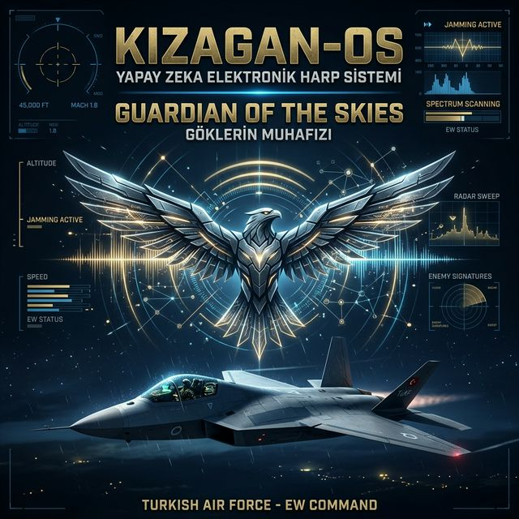
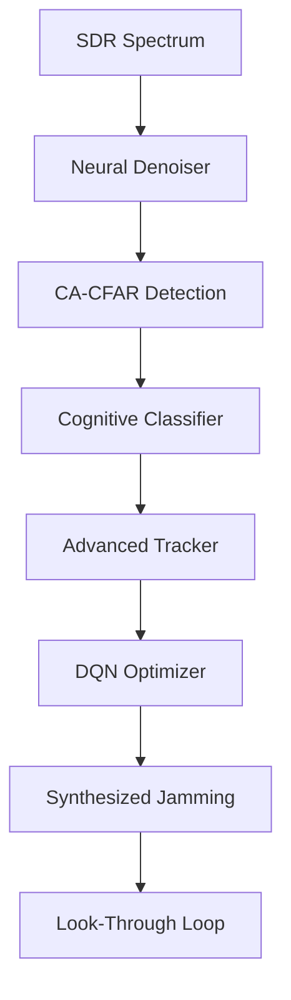

# 🛰️ Aegis-AI OMEGA v10.0 | Cognitive Electronic Warfare Suite



[](https://github.com/bahattinyunus/Otonom-Elektronik-Harp-Sistemi)
[](https://www.teknofest.org/)
[](#)
[](#)

**Aegis-AI OMEGA**, modern elektromanyetik spektrum operasyonlarında (EMSO) Derin Öğrenme (DL) ve Pekiştirmeli Öğrenme (RL) metodolojilerini merkezileştiren, otonom bir **Bilişsel Elektronik Harp (Cognitive EW)** platformudur. Sistem, LPI radarları ve frekans atlamalı haberleşme sistemlerine karşı proaktif üstünlük kurmak üzere tasarlanmıştır.

---

## 🏛️ Mimari Katmanlar (v10.0)

Sistem, donanım bağımsızlığı ve yüksek performans için 4 kritik katmanda mimarize edilmiştir:

### 1. SDR Hardware Abstraction Layer (HAL)
- **HW-Agnostic:** USRP, HackRF, RTLSDR ve `RFEnvironment` (Simülasyon) katmanları arasında kesintisiz geçiş.
- **MIMO Senkronizasyonu:** Çoklu alıcı nodları (ES-Nod) arasında faz senkronizasyonu ve TDOA optimizasyonu.

### 2. Cognitive Detection & Sensing (v4.5)
- **CA-CFAR Logic:** Dinamik gürültü zeminine (Noise Floor) uyumlu otonom eşikleme.
- **Neural Denoising:** 1D-CNN Autoencoder ile sinyal saflığının stokastik gürültü altında korunması.
- **UKF Tracking:** Non-lineer hedef manevralarını takip edebilen **Unscented Kalman Filter** mimarisi.

### 3. Artificial Intelligence & Decision (Cognitive Engine)
- **DQN EA Optimizer:** Deep Q-Network ajanı ile en uygun karıştırma (Jamming) politikasının otonom seçimi.
- **LSTM Hop Predictor:** Frekans atlamalı (FHSS) sistemlerin bir sonraki adımını %90+ doğrulukla kestiren sinir ağı.
- **Modülasyon Sınıflandırma:** PyTorch tabanlı Derin MLP/CNN ağları ile anlık modülasyon teşhisi.

### 4. Mission Control & C2 Dashboard
- **Mission State Machine:** SCAN, TRACK, ENGAGE ve EVALUATE fazlarını yöneten otonom durum makinesi.
- **Real-time C2 GUI:** Flask-SocketIO tabanlı, düşük gecikmeli (<100ms) taktik operasyon merkezi.
- **Self-Healing Watchdog:** Kritik modülleri otonom olarak izleyen ve re-init eden yüksek erişilebilirlik katmanı.

---

## 🛰️ Taktik Operasyonel Yetenekler



### Swarm Collaborative Intelligence
Sistem, birden fazla "Paydaş" nod ile spektral veriyi paylaşarak otonom de-confliction ve sürü tabanlı taarruz kabiliyeti sunar.

### Strategic Reporting (AAR)
Her görev sonrası, AI ajanının kararlarını ve operasyonel başarı metriklerini (Spectral Security Index, Effectiveness) içeren **Görev Sonu Kritik Analizi** otonom olarak üretilir.

---

## 🛠️ Kurulum ve Başlatma

### Gereksinimler
- Python 3.10+
- PyTorch (CUDA desteği önerilir)
- USRP Hardware Driver (UHD) / SoapySDR

### Hızlı Başlangıç
```bash
# Bağımlılıkları Kur
pip install -r requirements.txt

# Sistemi Dashboard Modunda Başlat
python main.py
```

### Docker (Production Mode)
```bash
docker-compose up --build -d
```
Sisteme `http://localhost:5000` üzerinden erişebilirsiniz.

---

## 🧠 Bilişsel Yapay Zeka Evrim Planı (Cognitive AI Strategic Roadmap)

Aegis-AI OMEGA sisteminin kalbini oluşturan Bilişsel Motor'un (Cognitive Engine) sahada tam otonom bir "Elektronik Harp Subayı"na dönüşebilmesi için belirlenmiş çok katmanlı, askeri sınıf AI stratejisidir:

### 🟩 FAZ I: Sensör Füzyonu ve Hızlı Teşhis (Mevcut Durum & Yakın Vade)
- **Derin Sinyal Teşhisi:** Mevcut 1D-CNN modülasyon sınıflandırıcının, daha karmaşık dalga formları (LPI radar dizileri, FHSS sekansları) için kompleks değerli sinir ağlarına (CVNN) dönüştürülmesi.
- **Spectrum Transformer (Sig-ViT) Geçişi:** Geleneksel RNN/LSTM yapılarından ziyade, Attention mekanizmaları (Self-Attention) kullanarak geniş spektrumlu frekans atlamalı senkronizasyonları saniyenin altında çözen Transformer mimarisinin entegrasyonu.
- **Spectrum Denoising (Otoenkoderler):** Kirli ve parazitli RF ortamlarında hedefin zayıf sinyalini derin Otoenkoder ağları ile ayrıştırıp, SNR (Signal-to-Noise Ratio) değerini yazılımsal olarak dramatik ölçüde artıran gürültü bastırma filtreleri.

### 🟨 FAZ II: Bilişsel Taarruz ve Kolektif Aksiyon (Orta Vade)
- **Multi-Agent Reinforcement Learning (MARL):** Birden fazla İHA/İKA veya yer konuşlu sistemin, merkezi komutaya ihtiyaç duymaksızın birbirleriyle spektral durumu teyit edip koordine (Swarm) bir biçimde "Dağıtık Elektronik Karıştırma" şokları uygulayabildiği taktik hücum motoru.
- **Federated Learning (Hibrit Kenar Öğrenme):** Operasyon sahasındaki düğümlerin elde ettiği hassas IQ verilerini merkeze iletmek yerine kendi bünyesinde ders çıkarıp, yalnızca "öğrenilmiş ağırlıkları (weights)" ana karargah ile güvenle senkronize ettiği güvenlik mimarisi.
- **Zero-Shot / Few-Shot Threat Detection:** Önceden hiç eğitilmediği, kütüphanesinde bulunmayan "Yabancı / Özel" askeri dalga formlarını tespit ettiği an "Bilinmeyen Tehdit" olarak etiketleyip, davranışsal haritasını saniyeler içerisinde çıkarabilme yeteneği.

### 🟥 FAZ III: Uç Nokta İnfazı ve Askeri Entegrasyon (Uzun Vade - TRL 9)
- **AI-on-the-Edge & FPGA Hızlandırması (Hardware-in-the-Loop):** Dev PyTorch modellerinin ONNX/TensorRT ile kuantize edilerek doğrudan SDR cihazının kalbine, Xilinx Zynq / RFSoC FPGA yongalarına gömülmesi; milisaniyenin binde biri (mikrosaniye) sürede reaksiyon kapasitesi (Deep Learning at the Edge).
- **LLM-Driven Taktik Asistan:** Arka planda dönen yüzbinlerce satır harp logunu natürel dil işleme teknolojileri ile süzüp, taktik komutan ekranına RAG destekli "Tavsiye Stratejiler" ve "Karar Özetleri" sunan Komuta YZ Asistanı (Local LLM Integration).
- **Digital Twin Simulation (Sürekli Sentetik Taktik Evrimi):** Sistemin, hiçbir operasyon olmadığında dijital ikiziyle (Digital Twin) binlerce saat "Kendi Kendine Sanal Cenk" (Self-Play) pratiği yaparak daha insanın hayal edemediği asimetrik ve radikal karıştırma (ECCM) dalga oyunları icat edebilmesi.

---

## 🚀 Akademik Vizyon ve Nihai Otonomi
Bu proje, salt bir yazılım mimarisi değil, elektromanyetik spektrumda hayatta kalmanın sadece "Daha akıllı algoritmalarla" mümkün olacağını gösteren akademik bir vizyondur. İnsansız Hava Araçları (İHA) ve Otonom Kara Araçları (İKA) için GNU Radio / UHD (USRP Hardware Driver) uyumluluğu gözetilerek yazılmış bu iskelet, modüler yapısı sayesinde gerçek donanımlarla bir "Otonom Elektronik Harp Subayı" olarak işlev görme nihai hedefine (TRL-9) adaydır.